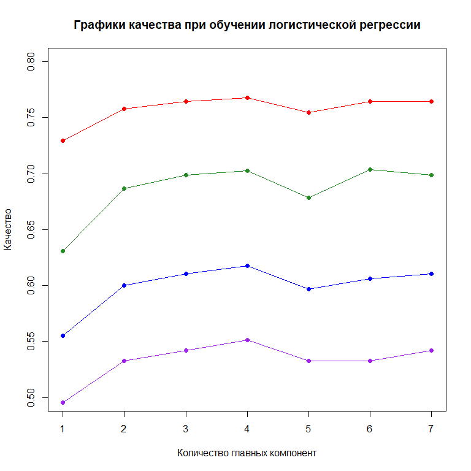

## Введение


Данные, используемые в текущем проекте, содержат ряд диагностических показателей диабета 2 типа у женщин из индийского наследия Пима, а также того, имеет ли индивидуум диабет 2 типа.

Всего имеется 768 наблюдений и 9 переменных. Переменные в наборе данных:

-   Беременности
-   Глюкоза - концентрация глюкозы в плазме крови после 2-часового орального теста на толерантность к глюкозе.
-   BloodPressure - Диастолическое артериальное давление (мм / HG).
-   SkinThickness - толщина трицепса (мм).
-   Инсулин - 2 часа сывороточного инсулина (м.е. / мл).  https://ru.wikipedia.org/wiki/%D0%9C%D0%B5%D0%B6%D0%B4%D1%83%D0%BD%D0%B0%D1%80%D0%BE%D0%B4%D0%BD%D0%B0%D1%8F_%D0%B5%D0%B4%D0%B8%D0%BD%D0%B8%D1%86%D0%B0
-   ИМТ - индекс массы тела (кг / м в квадрате)
-   DiabetesPedigreeFunction - функция, которая определяет риск развития диабета 2 типа на основе семейного анамнеза. Чем больше функция, тем выше риск развития диабета 2 типа.
-   Возраст.
-   Результат - диагностирован ли у человека диабет 2 типа (1 = да, 0 = нет).

Особенно интересным атрибутом, использованным в исследовании, была «Родословная функция диабета». Он предоставил некоторые данные об истории сахарного диабета у родственников и генетических отношениях этих родственников с пациентом. Эта мера генетического влияния дала нам представление о наследственном риске, который может возникнуть при появлении сахарного диабета. Основываясь на наблюдениях в последующем разделе, неясно, насколько хорошо эта функция предсказывает начало диабета.


Посмотрим на структуру данных


```
## 'data.frame':	768 obs. of  9 variables:
##  $ Pregnancies             : int  6 1 8 1 0 5 3 10 2 8 ...
##  $ Glucose                 : int  148 85 183 89 137 116 78 115 197 125 ...
##  $ BloodPressure           : int  72 66 64 66 40 74 50 0 70 96 ...
##  $ SkinThickness           : int  35 29 0 23 35 0 32 0 45 0 ...
##  $ Insulin                 : int  0 0 0 94 168 0 88 0 543 0 ...
##  $ BMI                     : num  33.6 26.6 23.3 28.1 43.1 25.6 31 35.3 30.5 0 ...
##  $ DiabetesPedigreeFunction: num  0.627 0.351 0.672 0.167 2.288 ...
##  $ Age                     : int  50 31 32 21 33 30 26 29 53 54 ...
##  $ Outcome                 : int  1 0 1 0 1 0 1 0 1 1 ...
```

Выведем все метаданные

+--------------------------+--------------------------------------------------------------------------+------------------------------------------------------------------------------------------------------------------------------------------------------+-------------------+
| Название поля            | Трактовка                                                                | Трактовка на русском                                                                                                                                 | Единицы измерения |
+==========================+==========================================================================+======================================================================================================================================================+===================+
| Pregnancies              | Number of times pregnant                                                 | Беременностей                                                                                                                                        | шт.               |
+--------------------------+--------------------------------------------------------------------------+------------------------------------------------------------------------------------------------------------------------------------------------------+-------------------+
| Glucose                  | Plasma glucose concentration a 2 hours in an oral glucose tolerance test | Концентрация глюкозы в плазме через 2 часа при пероральном тесте на толерантность к глюкозе                                                          | ммоль/л           |
+--------------------------+--------------------------------------------------------------------------+------------------------------------------------------------------------------------------------------------------------------------------------------+-------------------+
| BloodPressure            | Diastolic blood pressure (mm Hg)                                         | Диастолическое артериальное давление (мм рт. Ст.)                                                                                                    | мм.рт.ст          |
+--------------------------+--------------------------------------------------------------------------+------------------------------------------------------------------------------------------------------------------------------------------------------+-------------------+
| SkinThickness            | Triceps skin fold thickness (mm)                                         | Толщина кожной складки трицепса (мм)                                                                                                                 | мм                |
+--------------------------+--------------------------------------------------------------------------+------------------------------------------------------------------------------------------------------------------------------------------------------+-------------------+
| Insulin                  | 2-Hour serum insulin (mu U/ml)                                           | 2-часовой сывороточный инсулин (мЕд/мл, мМЕ/мл) - сколько микрограмм того или иного вещества соответствуют условной единице биологической активности | мЕд/мл            |
+--------------------------+--------------------------------------------------------------------------+------------------------------------------------------------------------------------------------------------------------------------------------------+-------------------+
| BMI                      | Body mass index (weight in kg/(height in m)\^2)                          | Индекс массы тела (вес в кг / (рост в м) \^ 2)                                                                                                       | кг / (м\^2)       |
+--------------------------+--------------------------------------------------------------------------+------------------------------------------------------------------------------------------------------------------------------------------------------+-------------------+
| DiabetesPedigreeFunction | Diabetes pedigree function                                               | Родословная диабетическая функция                                                                                                                    | у.е.              |
+--------------------------+--------------------------------------------------------------------------+------------------------------------------------------------------------------------------------------------------------------------------------------+-------------------+
| Age                      | Age (years)                                                              | Возраст                                                                                                                                              | Годы              |
+--------------------------+--------------------------------------------------------------------------+------------------------------------------------------------------------------------------------------------------------------------------------------+-------------------+
| Outcome                  | Class variable (0 or 1) 268 of 768 are 1, the others are 0               | Переменная класса (0 или 1) 268 из 768 равны 1, остальные равны 0                                                                                    | логическая        |
+--------------------------+--------------------------------------------------------------------------+------------------------------------------------------------------------------------------------------------------------------------------------------+-------------------+

: Метаданные полей


## Предварительный анализ

Сначала я изучил каждый атрибут и рассмотрел параметры распространения, подготовленные Weka Explorer. Я заметил, что:

-   Атрибуты preg и age являются целыми числами.
-   Население, как правило, молодое, менее 50 лет.
-   Некоторые атрибуты, где существует нулевое значение, кажутся ошибками в данных (например, Plas, Pres, Skin, InS и Mass).

Изучив распределение значений классов, я заметил, что существует 500 отрицательных случаев (65,1%) и 258 положительных случаев (34,9%).

<!-- -->


Рисунок 1. Корреляционная карта признаков данных.

<!-- -->

<!-- -->

<!-- -->

<!-- -->

<!-- -->

<!-- -->

<!-- -->

<!-- -->

Просмотр гистограмм всех атрибутов в наборе данных показывает нам, что:

-   Некоторые атрибуты выглядят нормально распределенными (plas, pres, skin и mass).
-   Некоторые из атрибутов выглядят так, как будто они имеют экспоненциальное распределение (preg, ins, pedi, age).
-   Возраст, вероятно, должен иметь нормальное распределение, ограничения на сбор данных могли исказить распределение.
-   Тестирование на нормальность (график нормальности) может представлять интерес. Мы могли бы посмотреть на подгонку данных к нормальному распределению.

Просмотр диаграмм разброса всех атрибутов в наборе данных показывает, что:

-   Не существует очевидной связи между возрастом и началом диабета.
-   Не существует очевидной связи между функцией педи и началом диабета.
-   Это может свидетельствовать о том, что диабет не является наследственным или что функция родословной диабета нуждается в работе.
-   Более высокие значения плазмы в сочетании с более высокими значениями для возраста, педиатрии, массы, инсулиновой, кожной, жировой ткани и прегина, как правило, показывают большую вероятность положительного результата теста на диабет.


## Очистка данных

По предъявленным распределениям для некоторых измерений можно заранее принять тот факт, что неокторые данные были собраны ошибочно. На основе таких величин можно провести некоторую фильтрацию данных измерений


```
## 'data.frame':	392 obs. of  9 variables:
##  $ Pregnancies             : int  1 0 3 2 1 5 0 1 1 3 ...
##  $ Glucose                 : int  89 137 78 197 189 166 118 103 115 126 ...
##  $ BloodPressure           : int  66 40 50 70 60 72 84 30 70 88 ...
##  $ SkinThickness           : int  23 35 32 45 23 19 47 38 30 41 ...
##  $ Insulin                 : int  94 168 88 543 846 175 230 83 96 235 ...
##  $ BMI                     : num  28.1 43.1 31 30.5 30.1 25.8 45.8 43.3 34.6 39.3 ...
##  $ DiabetesPedigreeFunction: num  0.167 2.288 0.248 0.158 0.398 ...
##  $ Age                     : int  21 33 26 53 59 51 31 33 32 27 ...
##  $ Outcome                 : int  0 1 1 1 1 1 1 0 1 0 ...
```


<!-- -->


<!-- -->


<!-- -->


<!-- -->


<!-- -->


<!-- -->


<!-- -->


<!-- -->


<!-- -->


<!-- -->


<!-- -->


<!-- -->


<!-- -->


<!-- -->


<!-- -->


<!-- -->

## Парные корреляции

<!-- -->

<!-- -->

<!-- -->

<!-- -->

## Перевод величин в систему СИ


\[
  \kappa_1 = BloodPressure \cdot Age^2 \cdot Insulin^{-1} \cdot SkinThickness^2
\]


<!-- -->


<!-- -->


<!-- -->


<!-- -->


<!-- -->


## Метод главных компонент


```
## Loading required package: usethis
```

```
## Welcome! Want to learn more? See two factoextra-related books at https://goo.gl/ve3WBa
```

<!-- -->


<!-- -->
### Модель на две главные компоненты


```
## 
## Call:
## glm(formula = df_filtered_train$Outcome ~ res.pca$x[, 1] + res.pca$x[, 
##     2], family = binomial)
## 
## Deviance Residuals: 
##     Min       1Q   Median       3Q      Max  
## -2.4146  -0.7842  -0.4330   0.8502   2.3556  
## 
## Coefficients:
##                Estimate Std. Error z value Pr(>|z|)    
## (Intercept)    -0.86837    0.14570  -5.960 2.52e-09 ***
## res.pca$x[, 1]  0.83081    0.10551   7.874 3.43e-15 ***
## res.pca$x[, 2]  0.03587    0.10391   0.345     0.73    
## ---
## Signif. codes:  0 '***' 0.001 '**' 0.01 '*' 0.05 '.' 0.1 ' ' 1
## 
## (Dispersion parameter for binomial family taken to be 1)
## 
##     Null deviance: 402.89  on 313  degrees of freedom
## Residual deviance: 313.74  on 311  degrees of freedom
## AIC: 319.74
## 
## Number of Fisher Scoring iterations: 4
```

<!-- -->


```
## $matrix
##        real0 real1
## model0   176    54
## model1    31    53
## 
## $precision
## [1] 0.6309524
## 
## $recall
## [1] 0.4953271
## 
## $F1
## [1] 0.5549738
## 
## $accuracy
## [1] 0.7292994
```

### Модель на три главные компоненты


```
## 
## Call:
## glm(formula = df_filtered_train$Outcome ~ res.pca$x[, 1] + res.pca$x[, 
##     2] + res.pca$x[, 3], family = binomial)
## 
## Deviance Residuals: 
##     Min       1Q   Median       3Q      Max  
## -3.1393  -0.7339  -0.4349   0.8144   2.2778  
## 
## Coefficients:
##                Estimate Std. Error z value Pr(>|z|)    
## (Intercept)    -0.85402    0.14705  -5.808 6.34e-09 ***
## res.pca$x[, 1]  0.86401    0.10983   7.867 3.63e-15 ***
## res.pca$x[, 2]  0.03691    0.10585   0.349  0.72729    
## res.pca$x[, 3] -0.40833    0.14009  -2.915  0.00356 ** 
## ---
## Signif. codes:  0 '***' 0.001 '**' 0.01 '*' 0.05 '.' 0.1 ' ' 1
## 
## (Dispersion parameter for binomial family taken to be 1)
## 
##     Null deviance: 402.89  on 313  degrees of freedom
## Residual deviance: 304.57  on 310  degrees of freedom
## AIC: 312.57
## 
## Number of Fisher Scoring iterations: 4
```


<!-- --><!-- --><!-- -->


<!-- -->

<!-- -->


```
## $matrix
##        real0 real1
## model0   181    50
## model1    26    57
## 
## $precision
## [1] 0.686747
## 
## $recall
## [1] 0.5327103
## 
## $F1
## [1] 0.6
## 
## $accuracy
## [1] 0.7579618
```

### Модель на четыре главные компоненты


```
## 
## Call:
## glm(formula = df_filtered_train$Outcome ~ res.pca$x[, 1] + res.pca$x[, 
##     2] + res.pca$x[, 3] + res.pca$x[, 4], family = binomial)
## 
## Deviance Residuals: 
##     Min       1Q   Median       3Q      Max  
## -3.2832  -0.7330  -0.4183   0.8169   2.2556  
## 
## Coefficients:
##                Estimate Std. Error z value Pr(>|z|)    
## (Intercept)    -0.85479    0.14721  -5.806 6.38e-09 ***
## res.pca$x[, 1]  0.87135    0.11098   7.851 4.11e-15 ***
## res.pca$x[, 2]  0.04701    0.10718   0.439  0.66099    
## res.pca$x[, 3] -0.41496    0.14027  -2.958  0.00309 ** 
## res.pca$x[, 4] -0.15035    0.14775  -1.018  0.30886    
## ---
## Signif. codes:  0 '***' 0.001 '**' 0.01 '*' 0.05 '.' 0.1 ' ' 1
## 
## (Dispersion parameter for binomial family taken to be 1)
## 
##     Null deviance: 402.89  on 313  degrees of freedom
## Residual deviance: 303.52  on 309  degrees of freedom
## AIC: 313.52
## 
## Number of Fisher Scoring iterations: 5
```

```
## $matrix
##        real0 real1
## model0   182    49
## model1    25    58
## 
## $precision
## [1] 0.6987952
## 
## $recall
## [1] 0.5420561
## 
## $F1
## [1] 0.6105263
## 
## $accuracy
## [1] 0.7643312
```

### Модель на 5 главных компонент


```
## 
## Call:
## glm(formula = df_filtered_train$Outcome ~ res.pca$x[, 1] + res.pca$x[, 
##     2] + res.pca$x[, 3] + res.pca$x[, 4] + res.pca$x[, 5], family = binomial)
## 
## Deviance Residuals: 
##     Min       1Q   Median       3Q      Max  
## -3.3043  -0.7288  -0.4171   0.8130   2.2416  
## 
## Coefficients:
##                Estimate Std. Error z value Pr(>|z|)    
## (Intercept)    -0.85373    0.14723  -5.799 6.68e-09 ***
## res.pca$x[, 1]  0.87197    0.11106   7.851 4.12e-15 ***
## res.pca$x[, 2]  0.04693    0.10738   0.437  0.66206    
## res.pca$x[, 3] -0.41512    0.14027  -2.959  0.00308 ** 
## res.pca$x[, 4] -0.15121    0.14778  -1.023  0.30618    
## res.pca$x[, 5] -0.04143    0.16985  -0.244  0.80729    
## ---
## Signif. codes:  0 '***' 0.001 '**' 0.01 '*' 0.05 '.' 0.1 ' ' 1
## 
## (Dispersion parameter for binomial family taken to be 1)
## 
##     Null deviance: 402.89  on 313  degrees of freedom
## Residual deviance: 303.47  on 308  degrees of freedom
## AIC: 315.47
## 
## Number of Fisher Scoring iterations: 5
```

```
## $matrix
##        real0 real1
## model0   182    48
## model1    25    59
## 
## $precision
## [1] 0.702381
## 
## $recall
## [1] 0.5514019
## 
## $F1
## [1] 0.617801
## 
## $accuracy
## [1] 0.7675159
```


## Модель на 6 главных компонент


```
## 
## Call:
## glm(formula = df_filtered_train$Outcome ~ res.pca$x[, 1] + res.pca$x[, 
##     2] + res.pca$x[, 3] + res.pca$x[, 4] + res.pca$x[, 5] + res.pca$x[, 
##     6], family = binomial)
## 
## Deviance Residuals: 
##     Min       1Q   Median       3Q      Max  
## -2.9956  -0.6834  -0.3927   0.7355   2.2925  
## 
## Coefficients:
##                Estimate Std. Error z value Pr(>|z|)    
## (Intercept)    -0.90808    0.15321  -5.927 3.08e-09 ***
## res.pca$x[, 1]  0.90361    0.11444   7.896 2.88e-15 ***
## res.pca$x[, 2]  0.06140    0.11054   0.555 0.578560    
## res.pca$x[, 3] -0.39560    0.13851  -2.856 0.004289 ** 
## res.pca$x[, 4] -0.18577    0.15467  -1.201 0.229714    
## res.pca$x[, 5] -0.04867    0.17464  -0.279 0.780465    
## res.pca$x[, 6]  0.75741    0.21866   3.464 0.000532 ***
## ---
## Signif. codes:  0 '***' 0.001 '**' 0.01 '*' 0.05 '.' 0.1 ' ' 1
## 
## (Dispersion parameter for binomial family taken to be 1)
## 
##     Null deviance: 402.89  on 313  degrees of freedom
## Residual deviance: 291.06  on 307  degrees of freedom
## AIC: 305.06
## 
## Number of Fisher Scoring iterations: 5
```

```
## $matrix
##        real0 real1
## model0   180    50
## model1    27    57
## 
## $precision
## [1] 0.6785714
## 
## $recall
## [1] 0.5327103
## 
## $F1
## [1] 0.5968586
## 
## $accuracy
## [1] 0.7547771
```


### Модель на 7 гланых компонент


```
## 
## Call:
## glm(formula = df_filtered_train$Outcome ~ res.pca$x[, 1] + res.pca$x[, 
##     2] + res.pca$x[, 3] + res.pca$x[, 4] + res.pca$x[, 5] + res.pca$x[, 
##     6] + res.pca$x[, 7], family = binomial)
## 
## Deviance Residuals: 
##     Min       1Q   Median       3Q      Max  
## -2.9531  -0.6856  -0.3827   0.7304   2.2610  
## 
## Coefficients:
##                Estimate Std. Error z value Pr(>|z|)    
## (Intercept)    -0.90957    0.15339  -5.930 3.04e-09 ***
## res.pca$x[, 1]  0.90834    0.11518   7.886 3.12e-15 ***
## res.pca$x[, 2]  0.06283    0.11103   0.566 0.571490    
## res.pca$x[, 3] -0.39065    0.13808  -2.829 0.004667 ** 
## res.pca$x[, 4] -0.19737    0.15640  -1.262 0.206945    
## res.pca$x[, 5] -0.04817    0.17458  -0.276 0.782599    
## res.pca$x[, 6]  0.76520    0.21892   3.495 0.000474 ***
## res.pca$x[, 7]  0.26811    0.25417   1.055 0.291494    
## ---
## Signif. codes:  0 '***' 0.001 '**' 0.01 '*' 0.05 '.' 0.1 ' ' 1
## 
## (Dispersion parameter for binomial family taken to be 1)
## 
##     Null deviance: 402.89  on 313  degrees of freedom
## Residual deviance: 289.94  on 306  degrees of freedom
## AIC: 305.94
## 
## Number of Fisher Scoring iterations: 5
```

```
## $matrix
##        real0 real1
## model0   183    50
## model1    24    57
## 
## $precision
## [1] 0.7037037
## 
## $recall
## [1] 0.5327103
## 
## $F1
## [1] 0.606383
## 
## $accuracy
## [1] 0.7643312
```


### Модель на 8 гланых компонент


```
## 
## Call:
## glm(formula = df_filtered_train$Outcome ~ res.pca$x[, 1] + res.pca$x[, 
##     2] + res.pca$x[, 3] + res.pca$x[, 4] + res.pca$x[, 5] + res.pca$x[, 
##     6] + res.pca$x[, 7] + res.pca$x[, 8], family = binomial)
## 
## Deviance Residuals: 
##     Min       1Q   Median       3Q      Max  
## -2.8800  -0.6865  -0.3863   0.7187   2.2281  
## 
## Coefficients:
##                Estimate Std. Error z value Pr(>|z|)    
## (Intercept)    -0.90990    0.15352  -5.927 3.09e-09 ***
## res.pca$x[, 1]  0.90736    0.11490   7.897 2.85e-15 ***
## res.pca$x[, 2]  0.06438    0.11158   0.577 0.563970    
## res.pca$x[, 3] -0.39399    0.13953  -2.824 0.004747 ** 
## res.pca$x[, 4] -0.19372    0.15696  -1.234 0.217135    
## res.pca$x[, 5] -0.04431    0.17385  -0.255 0.798820    
## res.pca$x[, 6]  0.76354    0.22011   3.469 0.000523 ***
## res.pca$x[, 7]  0.27861    0.25567   1.090 0.275837    
## res.pca$x[, 8] -0.21544    0.27058  -0.796 0.425905    
## ---
## Signif. codes:  0 '***' 0.001 '**' 0.01 '*' 0.05 '.' 0.1 ' ' 1
## 
## (Dispersion parameter for binomial family taken to be 1)
## 
##     Null deviance: 402.89  on 313  degrees of freedom
## Residual deviance: 289.30  on 305  degrees of freedom
## AIC: 307.3
## 
## Number of Fisher Scoring iterations: 5
```

```
## $matrix
##        real0 real1
## model0   182    49
## model1    25    58
## 
## $precision
## [1] 0.6987952
## 
## $recall
## [1] 0.5420561
## 
## $F1
## [1] 0.6105263
## 
## $accuracy
## [1] 0.7643312
```


## Графики на обучении

<!-- -->


<!-- -->

```
## $matrix
##        real0 real1
## model0    55    17
## model1     0     6
## 
## $precision
## [1] 1
## 
## $recall
## [1] 0.2608696
## 
## $F1
## [1] 0.4137931
## 
## $accuracy
## [1] 0.7820513
```


<!-- -->

